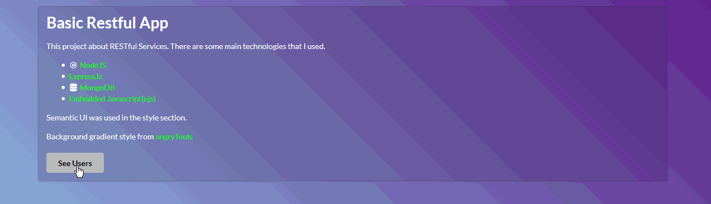

# Restful Web App

### Description ###
This project about <b>RESTful</b> web services and get data from server side. I used some important technologies in this project.

> Technologies

* [NodeJs](https://nodejs.org/en/)
* [ExpressJs](https://expressjs.com/)
* [MongoDB](https://www.mongodb.com/)
* [Embedded Javascript](http://www.embeddedjs.com/)
* [Semantic-UI](https://semantic-ui.com/)
* **Dependencies**
    * body-parser: *1.18.2*
    * ejs: *2.5.7*
    * express: *4.16.2*
    * method-override: *2.3.10*
    * mongoose: *5.0.7*

> Project Topic

Main topic of this project is save user information to server and to see this user from user table. 
In addition you can edit these users or remove them.

 

> Core

All of those processes use some necessarry routes (`get`, `post`, `put`, `delete`) and proper service path. 
I used **NodeJs** in server side and **MongoDB** which is NoSQL technology in database part.
In html part, I used **embedded javascript(ejs)** to get service data. **Semantic-UI** 
is the style part of my project.

> RESTful Routes

| Name   | Path            | HTTP Verb | Purpose                                     	|
|--------|-----------------|-----------|------------------------------------------------|
| Index  | /               | GET       | Project topic                               	|
| Index  | /users          | GET       | List all users                              	|
| New    | /users/new      | GET       | Show new user form                          	|
| Create | /users          | POST      | Create new user then redirect to /users     	|
| Edit   | /users/:id/edit | GET       | Show edit user form                         	|
| Update | /users/:id      | PUT       | Update particular user then redirect to /users |
| Remove | /users/:id      | DELETE    | Delete particular user then redirect to /users |

### Installation ###
You need to install **NodeJs** and **MongoDB** to use this application. 
**MongoDB**  
	1. Download [Windows Server 2008](https://www.mongodb.com/download-center?jmp=nav#community) 
	2. Install MongoDB to any file location in your computer.
	3. Create new folder to any location in your computer to store your MongoDB data.
	4. Open new control panel change your directory according to where you install your MongoDB Server
	 and go to bin folder. Example : `cd D:\ProgramFiles\MongoDB\Server\3.6\bin`
	5. Enter these commands into the control panel to start MongoDB server:`mongod --dbpath D:\yourMongoDBdataFolder`
	6. You can check your data with type this command in current location (MongoDB\Server\3.6\bin) :`mongo`  
**NodeJS**

* Run `npm install` from the project's root to install it and its dependencies.
* Open new control panel and change current directory to project directory and type `node app.js` to start server.

Now you can open your project go to `http://localhost:8080` in your browser.
	

### Credits ###

* Oktay Koçer

### License ###

* [License File](LICENSE)

